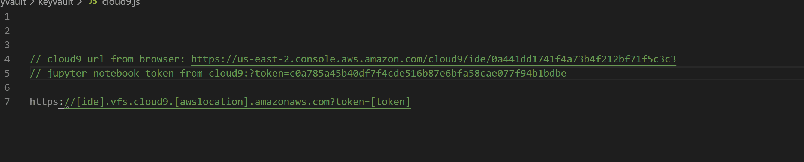
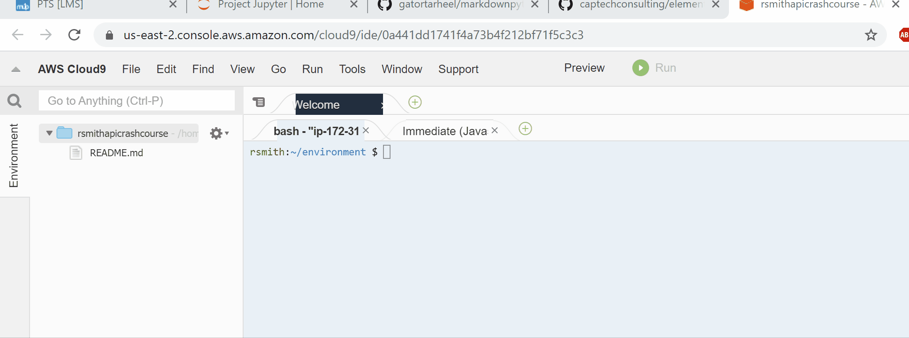

# Elementary Python Data 1

## Objective

Set up a Jupyter environment for future projects.
Jupyter notebooks are good for basic lists, dictionaries and data fundamentals.

## Bookmarks

[CapTech AWS Training](captech-training.signin.aws.amazon.com)  
Teams Wray Mills for access.  
[Serverless API Crash Course](https://cap3totl.com/serverless-api-crash-course.html)  
<!--  -->

## Setup  

Follow the instructions from [Serverless API Crash Course](https://cap3totl.com/serverless-api-crash-course.html) to get your Cloud9 environment up and running.  
Return to these instructions when Cloud9 is running.  

Stay in your Cloud9 environment in the terminal.  ("name/environment") 

### To double-check your Cloud9 installation of python  

* type `python`
* the command prompt switches to a python environment with your python version listed with details and `>>>`  
* type `quit()` to exit the python environment  
  

("pythonproof.jpg" "Logo Title Text 1")  

pythonproof.JPG

pythonproof.jpg

<h2>Install Jupyter</h2>

Download Jupyter to your Cloud9 environment 
* type `sudo python -m pip install jupyter` to install jupyter 
* To start your instance of Jupyter notebook, type `jupyter notebook --ip=0.0.0.0 --port=8080 --no-browser`
* This will load a Jupyter notebook instance - the next section will explain how to navigate to this notebook 

Next, you want to access your Jupyter notebook from your local browser but still connected to your Cloud9 instance to create, essentially, a cloud-based Jupyter notebook.  There are 3 components of the URL needed to access your notebook. 
* Your Cloud9 ID which is the last part of the URL running your Cloud9 IDE (if my URL is: https://us-east-1.console.aws.amazon.com/cloud9/ide/dcbff7a4ca74491e92064bfc5c566f63, the part I need is dcbff7a4ca74491e92064bfc5c566f63) 
* Add this string so the notebook is connected to your Cloud9 ".vfs.cloud9.us-east-1.amazonaws.com" 
* Add the token that is returned after the "jupyter notebook --ip..." line is run (if this is returned: http://(ip-172-31-43-116 or 127.0.0.1):8080/?token=f0fd2088ff3226bc2df8fb77098f1ebc3178b9bcb758d9c3, you need: ?token=f0fd2088ff3226bc2df8fb77098f1ebc3178b9bcb758d9c3 added to the end) 
* In summary: my URL to add to a new tab is: http://dcbff7a4ca74491e92064bfc5c566f63.vfs.cloud9.us-east-1.amazonaws.com?token=f0fd2088ff3226bc2df8fb77098f1ebc3178b9bcb758d9c3

This URL should take you to your Jupyter notebook where you should see the cloned repo folder for this assignment.  Open the assignment folder, click on the notebook file (Data 1.ipynb) and you are ready to start the assignment! 

## Git Process

 * GitHub Classroom creates a private repo for your assignment.
 * Clone this repo in your Cloud9 environment with `git clone <repo_name>`.
  
 * Do your work on the `dev` branch. Execute `git checkout -b dev` in the Cloud9 console. 
 
 * You will be saving your notebook using Jupyter. Jupyter will create many additional autosave files. You only need to commit changes to the main notebook file.
 * Commit and push to your `dev` branch as needed.
 * To _submit_ your assignment, create a PR (Pull Request) [in GitHub?]. This will signal us that your assignment is ready for review.

## Minimum Requirements

* Follow along the Data 1 notebook and add code as appropriate.
* There are 3 sections in the notebook where you should respond with working code or text.
* Your submitted assignment should include a notebook that has been edited with your additional code/solutions.

## Optional Next Steps

* Move the code into a Python program file and create a separate program file tester (using unittest).

## Rubric

| Criteria | Superior (5) | Excellent (4) | OK (3) | Not OK (2) | Unsatisfactory (1) | Grade/Comments |
| --- | --- | --- | --- | --- | --- | --- |
| Readability (50%) | The code is organized (modular) well documented, easy to read and follow. | The code is easy to read and well documented. | The code can be followed. | The code is not easily followed. | The code is a mess. |  |
| Specifications (40%) | The program works and meets all the requirements. | The program works and meets most of the requirements. | The program produces correct results but does not display/plot them correctly. | The program does not meet most of the requirements or fails to display or plot any. | Program does not work at all. |  |
| Efficiency (10%) | The code is highly efficient without affecting readability. | The code is reasonably efficient without affecting readability. | The code runs within a few seconds. | The code runs within a few minutes. | The code takes over an hour to run (or doesn't run at all). | |
